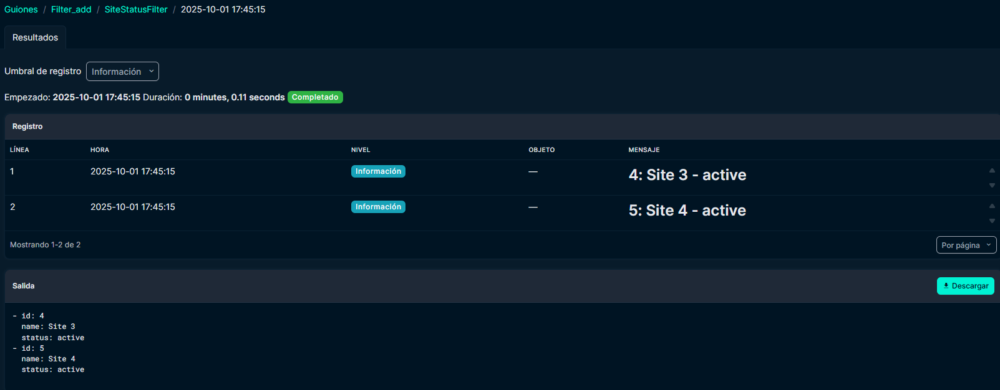

# Netbox-Practice
## Setup
Follow these instructions [link](https://netboxlabs.com/docs/netbox/installation/)
- **PostgreSQL**
    - Install Postgresql.
    - Create Database.
    - Create User for Database.
    - Authenticate with your new user to your database.
- **Redis**
    - Install Redis
    - Check connection
- **Netbox**
    - Check if Python is installed, otherwise install it.
    - Clone git repository: 
    ``sudo git clone https://github.com/netbox-community/netbox.git /opt/netbox/``
    - Create system user account named "netbox".
    - Change your config file `configuration.py` as wanted, use `configuration_example.py` as template.
        Things that you should always change:
        - ALLOWED_HOSTS | Here is where you chose your server name
        - DATABASES
        - REDIS
        - SECRET_KEY | Generate the key using:
        ``python3 ../generate_secret_key.py``

        **Add requirements to ``requirements.txt``:**
        - django-storages
        - boto3
        - sentry-sdk
        - pyuwsgi
    - Run upgrade script: 
    ``sudo /opt/netbox/upgrade.sh``
    - Activate virtual environment: 
    ``source /opt/netbox/venv/bin/activate``
    - Create Netbox superuser: 
    ``python3 manage.py createsuperuser``
- **Gunicorn**
    If you rather use uWSGI its also provided on the guide, I used Gunicorn.
    Setup gunicorn folder on the right path:
    ``sudo cp -v /opt/netbox/contrib/*.service /etc/systemd/system/``
    Then enable the both netbox and netbox-rq services:
    ``sudo systemctl enable --now netbox netbox-rq``
- **HTTPS Server**
    Obtain an SSL Certificate:
    ``sudo openssl req -x509 -nodes -days 365 -newkey rsa:2048 \
    -keyout /etc/ssl/private/netbox.key \
    -out /etc/ssl/certs/netbox.crt``
    Here you can choose to use a nginx or an Apache server. I used Apache:
    - Install apache:
    ``sudo apt install -y apache2``
    - Setup apache folder on the right path:
    ``sudo cp /opt/netbox/contrib/apache.conf /etc/apache2/sites-available/netbox.conf```
    - Enable Apache required modules:
    ``sudo a2enmod ssl proxy proxy_http headers rewrite``
    ``sudo a2ensite netbox``
    Then restart apache2 service.


    With this done you should be able to access netbox server using the server name specified.
    
    ## Scripts
    Both scripts are located at ``/netbox/netbox/scripts``
    #### filter_add.py
    This script filter Sites by status and can be imported inside netbox using its GUI at:
     ``https:<netbox>/extras/scripts/add/``
    **Run example:**
    
    #### api_query.py
    This script on the other hand is thought to be run through the terminal instead of the GUI and its porpuse its to query sites by status using Netbox API directly.
    **Run example:**

```bash
    python /opt/netbox/netbox/netbox/scripts/api_query.py planned
```
**Output:**
```bash
    Sites with status 'planned':
    - Site 1 (Slug: site_1, ID: 2)
    - Site 2 (Slug: site_2, ID: 3)
```
